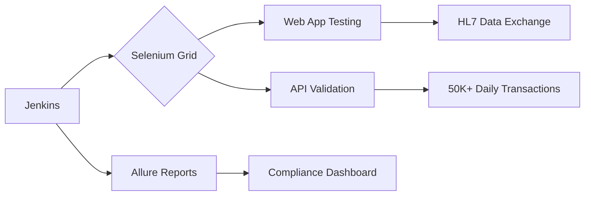
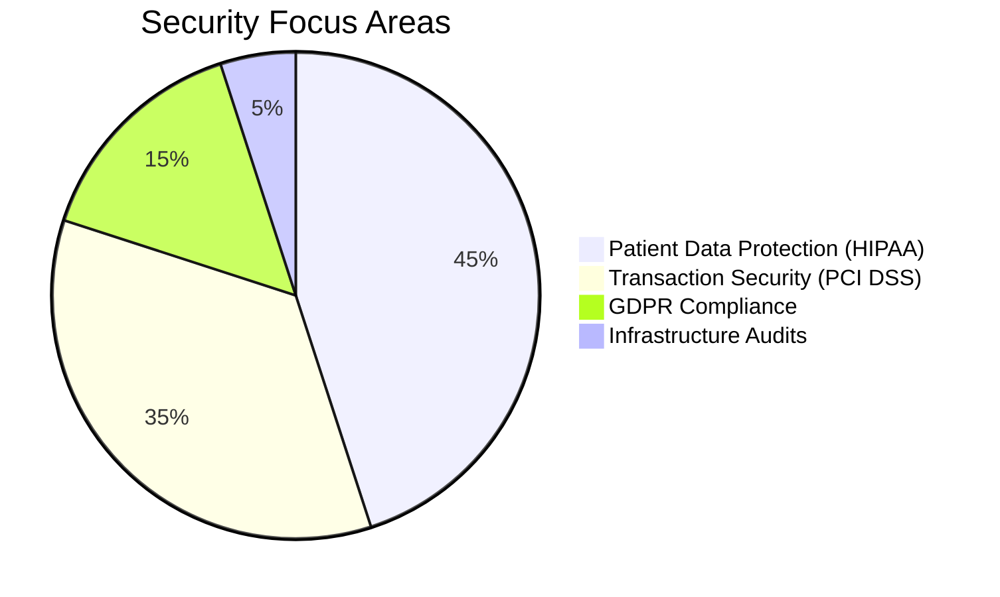

# Moqaddas Rahim 🔍 

*"Code with precision, test with purpose"*

## ⚙️ Technical Arsenal

<b>🚀 Core Competencies</b>

---

## 🏗️ Automation Framework Architecture

## 🏆 Key Metrics

| Area | Impact |
|---|---|
| Test Execution Time Reduction | 37.5% ⏱️ |
| Critical Defects Prevented | 150+ 🛡️ |
| CI/CD Pipeline Efficiency | 99.9% Uptime ⚡ |
| Team Productivity Boost | 20% 📈 |
| Cost Savings | $15K+/year 💰 |

---

## 📈 GitHub DNA

---

## 🛠️ Professional Journey

<b>CVS Health | QA Automation Engineer</b>

- ⚡ **Framework Innovation:** Built Selenium/Java BDD framework enabling bi-weekly releases
- 🛡️ **Compliance Mastery:** Automated HL7 data exchanges handling 50K+ daily transactions
- 🔄 **Pipeline Optimization:** Reduced post-deployment hotfixes by 25% through Jenkins integration
- 👥 **Team Leadership:** Mentored 5+ engineers in test automation best practices

<b>Wells Fargo | QA Automation Tester</b>

- 💳 **Financial Security:** Ensured PCI DSS compliance for transaction processing systems
- 🚀 **Regression Automation:** Automated 71% of test suites using Selenium/TestNG
- 📊 **Process Improvement:** Created real-time JIRA dashboards for 3 Scrum teams
- 💸 **Cost Control:** Saved $15K/year through legacy script migration

---

## 📚 Education & Growth
**B.S. Information Technology** (Expected 2026)  
*Los Angeles Pierce College*  
🏅 Relevant Coursework: Secure Coding Practices • QA Methodologies • Cloud Testing

**Technical Roadmap**:  
▰▰▰▰▰▰▰▰▱ 85% Containerization (Docker/Kubernetes)  
▰▰▰▰▰▱▱▱ 60% AI-Powered Test Generation  
▰▰▰▰▰▰▰▱▱ 75% Security Automation (OWASP ZAP)

---

## 🌐 Connect & Collaborate

<b>🧩 Compliance Architecture</b>

