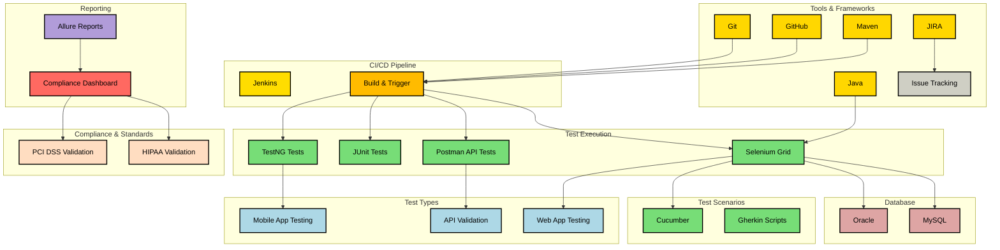

  

  <!-- Dark Overlay for Text Contrast -->

<!-- Overlay Text: Name, Slogan, and Hire Me Button -->

 

  

    "Located at the crossroads of creativity and excellence, I develop automation solutions that transform how products are tested and refined."
  

<!-- Hire Me Button -->
<a href="https://www.linkedin.com/in/moqaddas-qa-automation" target="_blank" rel="noopener noreferrer"
style="display: inline-block; padding: 12px 30px; font-size: 1.5em; font-weight: bold; color: #fff; text-decoration: none; background: #27ae60; border-radius: 6px; box-shadow: 0 0 20px rgba(39, 174, 96, 0.5); animation: glowing 1.5s infinite;">

Hire Me
</a>
  

## ⚙️ Technical Arsenal

<b>Languages & Frameworks</b>

  
  
  
  
  
  
  
  

<b>Build & Project Management Tools</b>

  
  
  
  

<b>Version Control & CI/CD</b>

  
  

<b>Databases</b>

  
  
  

<b>Markup & Scripting Languages</b>

  

<b>Operating Systems & General Tools</b>

  
  
  

<b>DevOps & Cloud Platforms</b>

  
  

<b>Mobile & Web Testing</b>

  
  
  
  

---

## 🚀 Core Competencies

  

    Automation Expertise & Design Patterns
  

  
  <!-- Core Automation Section -->
  

    

      
      
      
      
    

  

  <!-- Additional Patterns Section -->
  

    

      
      
      
      
      
    

  

---

## Certifications

<table>
  <tr>
    <td style="vertical-align: middle; padding-right: 8px;">
      
    </td>
    <td style="vertical-align: middle;">
      <strong>SDET Automation</strong> 
      Syntax Technologies
    </td>
  </tr>
  <tr>
    <td style="vertical-align: middle; padding-right: 8px;">
      
    </td>
    <td style="vertical-align: middle;">
      <strong>Other Certifications</strong>
    </td>
  </tr>
</table>

---

## Education

**Aria University** – Balkh, Afghanistan  
BA in Political Science (Sept 2014 – June 2018)  
*[Add additional education if applicable]*

---

<!-- Optional call-to-action -->

  
    Looking for collaborators or interested in working together? Feel free to reach out!
  

---

## 🏗️ Automation Framework Architecture

## 🏆 Key Metrics

| Area | Impact |
|---|---|
| Test Execution Time Reduction | 37.5% ⏱️ |
| Critical Defects Prevented | 150+ 🛡️ |
| CI/CD Pipeline Efficiency | 99.9% Uptime ⚡ |
| Team Productivity Boost | 20% 📈 |
| Cost Savings | $15K+/year 💰 |

---

## 📈 GitHub DNA

---

## 🛠️ Professional Journey

  
<b>CVS Health | QA Automation Engineer</b>

  <ul>
    <li>⚡ <b>Framework Innovation:</b> Built Selenium/Java BDD framework enabling bi-weekly releases</li>
    <li>🛡️ <b>Compliance Mastery:</b> Automated HL7 data exchanges handling 50K+ daily transactions</li>
    <li>🔄 <b>Pipeline Optimization:</b> Reduced post-deployment hotfixes by 25% through Jenkins integration</li>
    <li>👥 <b>Team Leadership:</b> Mentored 5+ engineers in test automation best practices</li>
  </ul>

  
<b>Wells Fargo | QA Automation Tester</b>

  <ul>
    <li>💳 <b>Financial Security:</b> Ensured PCI DSS compliance for transaction processing systems</li>
    <li>🚀 <b>Regression Automation:</b> Automated 71% of test suites using Selenium/TestNG</li>
    <li>📊 <b>Process Improvement:</b> Created real-time JIRA dashboards for 3 Scrum teams</li>
    <li>💸 <b>Cost Control:</b> Saved $15K/year through legacy script migration</li>
  </ul>

  
<b>AutoZone | Manual Tester</b>

  <ul>
    <li>🛠️ <b>Script Development:</b> Developed and maintained Selenium WebDriver scripts for regression and functional testing</li>
    <li>🔍 <b>API Testing:</b> Conducted manual testing of REST APIs using Postman, ensuring accuracy in API responses</li>
    <li>📈 <b>Collaboration:</b> Employed TestRail and Jira for efficient bug tracking and collaboration within Agile teams</li>
  </ul>

---

## 📚 Education & Growth
**B.S. Information Technology** (Expected 2026)  
*Los Angeles Pierce College*  
🏅 Relevant Coursework: Secure Coding Practices • QA Methodologies • Cloud Testing
  
## Technical Roadmap:

**Containerization (Docker)**  
🟦🟦🟦🟦🟦🟦⬜⬜⬜⬜ 60%

**AI-Powered Test Generation**  
🟦🟦🟦🟦🟦🟦🟦🟦🟦⬜ 90%

**Web-Based & Mobile Testing Automation (Selenium, Appium)**  
🟦🟦🟦🟦🟦🟦🟦🟦🟦🟦 100%

**Continuous Integration/Continuous Deployment (Jenkins)**  
🟦🟦🟦🟦🟦🟦🟦⬜⬜⬜ 70%

**Behavior-Driven Development (Cucumber, TestNG)**  
🟦🟦🟦🟦🟦🟦⬜⬜⬜⬜ 50%

---

## 🌐 Connect & Collaborate

<b>🧩 Compliance Architecture</b>

